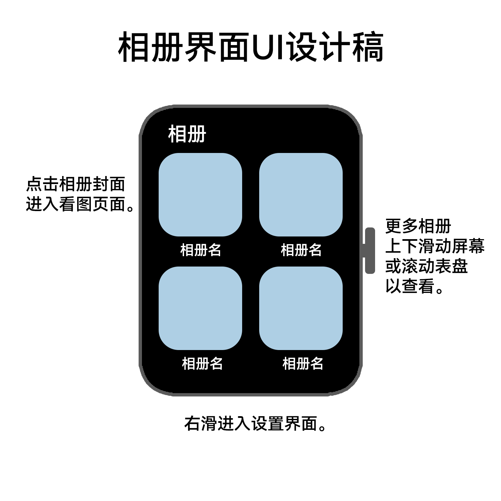

# MiniPic

MiniPic | 一款专为 Android 手表设计的轻量化图库

## 项目概览

| 项目 | 内容 |
| --- | --- |
| 应用名称 | MiniPic / 图库 |
| Application ID | `mini.pic` |
| 当前版本 | `0.0.6` / `versionCode 6` |
| 主要设备 | OPPO Watch OWW211，Android 11，378 × 496 |
| 最低系统 | Android API 23 |
| 编译 / 目标 SDK | 35 / 35 |
| 技术栈 | Kotlin、Android View、Material Components、RecyclerView |
| 构建工具 | Gradle Wrapper、Android Gradle Plugin 8.1.0 |
| 支持 ABI | `armeabi-v7a`、`arm64-v8a`、Universal |

这是一个仍在持续开发中的个人项目。当前版本已经可以在 OWW211 上完成图库浏览、单图查看和漫画阅读，但尚未发布到应用商店，也不承诺适配所有 Android 手表型号。

## 功能

### 图库

- 扫描设备本地图片并按目录聚合为相册。
- 支持 JPG、JPEG、PNG、WebP 和 GIF。
- 支持缓存、隐藏目录、隐藏图片和主页相册筛选。
- 使用 RecyclerView 和异步封面解码，减少图库页面的首屏负担。
- 支持通过 Android `image/*` 外部打开方式查看图片。

### 单图查看

- 支持缩放、平移和连续切换图片。
- 处理 EXIF 方向，避免旋转照片显示方向错误。
- 高倍率查看时按当前视口解码图片区域，降低大图一次性加载的内存压力。
- 支持复制、移动、删除、临时旋转和设置封面等文件操作。

### 漫画模式

- 按自然数字顺序排列文件名，例如 `1、2、10`，不会按字典序变成 `1、10、2`。
- 将相册内图片按屏幕宽度纵向连续拼接，适合阅读连续漫画页面。
- 支持触摸拖动、惯性滚动和缩放。
- 只异步加载当前视口及附近页面，并回收远离视口的 Bitmap。
- 可设置表冠用于漫画缩放，或关闭缩放后用于滚动漫画内容。

### 手表交互

- 适配 OPPO Watch 的硬件表冠输入。
- 普通页面、单图查看和漫画模式共享统一的表冠灵敏度处理。
- 当前实现针对 OWW211 的 `pixart_pat9125 / REL_WHEEL` 输入调校。

## 界面参考

仓库中保留了早期的相册界面设计参考：



实际界面和交互以当前源码及设备构建结果为准。

## 快速开始

### 环境要求

- JDK 17
- Android SDK Platform 35
- 可用的 Android SDK Build Tools
- Windows、macOS 或 Linux 均可使用仓库中的 Gradle Wrapper

### 获取源码

```bash
git clone https://github.com/Mooncyer/MiniPic
cd <your-repository>/android
```

### 构建 Debug APK

Windows PowerShell：

```powershell
.\gradlew.bat testDebugUnitTest lintDebug assembleDebug
```

macOS / Linux：

```bash
./gradlew testDebugUnitTest lintDebug assembleDebug
```

Debug APK 输出目录：

```text
android/app/build/outputs/apk/debug/
```

安装到已连接的 Android 设备：

```bash
adb install -r app/build/outputs/apk/debug/app-debug.apk
```

首次构建前，请确保 `JAVA_HOME` 指向 JDK 17，并且 Android SDK 已正确配置。也可以通过 Android Studio 打开 `android/` 目录进行构建。

## Release 构建与签名

Release 构建不应把 keystore、密码或真实签名配置提交到 Git。没有签名配置时，Gradle 仍可以生成本地 Release 构建，但交付前必须使用 `apksigner` 检查 APK 是否由正确的发布证书签名。

创建仓库外的 `keystore.properties`，内容格式如下：

```properties
storeFile=/absolute/path/to/minipic-release.jks
storePassword=YOUR_KEYSTORE_PASSWORD
keyAlias=minipic-release
keyPassword=YOUR_KEY_PASSWORD
```

Windows PowerShell 示例：

```powershell
$env:MINIPIC_KEYSTORE_PROPERTIES = 'D:\secure\minipic\keystore.properties'
.\gradlew.bat clean testDebugUnitTest lintDebug assembleRelease
```

macOS / Linux 示例：

```bash
export MINIPIC_KEYSTORE_PROPERTIES="$HOME/.config/minipic/keystore.properties"
./gradlew clean testDebugUnitTest lintDebug assembleRelease
```

可参考仓库中的配置模板 [`keystore.properties.example`](keystore.properties.example) 和发布说明 [`docs/maintenance/RELEASING.md`](docs/maintenance/RELEASING.md)。真实 keystore、密码和属性文件必须保存在仓库外，并加入本机的 Git 忽略规则。

Release APK 输出目录：

```text
android/app/build/outputs/apk/release/
```

构建 ABI 分包时会生成：

- `app-universal-release.apk`
- `app-armeabi-v7a-release.apk`
- `app-arm64-v8a-release.apk`

当前应用及依赖没有 native `.so`，因此不同 ABI 包的体积可能相同；ABI 分包主要用于兼容性和分发选择。

## 权限与隐私

MiniPic 以设备本地图片为核心，不需要账号，也没有网络服务依赖。应用当前未声明 Internet 权限。

图库扫描和文件操作会根据 Android 版本申请相应的本地存储权限：

- Android 13 及以上使用图片读取权限。
- 较旧系统使用 `READ_EXTERNAL_STORAGE` 等兼容权限。
- Android 11 及以上支持 `MANAGE_EXTERNAL_STORAGE`，并保留 MediaStore 只读回退路径。

`MANAGE_EXTERNAL_STORAGE` 受到 Google Play 严格限制。如果未来面向 Google Play 发布，需要重新评估为 MediaStore 和用户明确授权为主的存储方案。

## 已知限制

- 当前主要在 OPPO Watch OWW211（Android 11，378 × 496）上开发和验收，其他手表需要单独测试。
- ADB 的 `input roll` 不能完全模拟实体表冠的方向、刻度和连续滚动手感。
- 长篇漫画、高倍率图片和大量相册可能带来更高的内存和解码压力。
- 权限拒绝、URI 写入授权、删除确认等流程仍应在目标设备上进行端到端验证。
- 当前版本尚未发布到 Google Play 或其他应用商店。

## 项目结构

```text
android/                         Android 工程和活跃源码
├── app/src/main/java/mini/pic/
│   ├── MainActivity.kt           页面、权限、导航和文件操作协调
│   ├── GalleryModel.kt           扫描、排序、路径和图库数据规则
│   └── MangaView.kt              漫画连续阅读画布
└── app/src/test/                 JVM 单元测试

docs/                             需求、技术、维护和硬件文档
design/                           设计源、参考图和品牌素材
archive/                          历史 APK、快照、设备记录和测试素材
```

更多资料：

- [开发状态](docs/maintenance/DEVELOPMENT_STATUS.md)
- [技术说明](docs/maintenance/TECHNICAL.md)
- [发布与签名流程](docs/maintenance/RELEASING.md)
- [需求基线](docs/requirements/MiniPic_Elementary_Design.md)
- [OPPO Watch 表冠调研](docs/hardware/OPPOWatch_Crown.md)

Android 11+ 图库扫描/管理优先使用 `MANAGE_EXTERNAL_STORAGE`，同时保留只读图片权限回退。该权限受 Google Play 政策严格限制；若目标发布渠道是 Play，需要重新设计为 MediaStore 和用户授权为主的存储方案。
